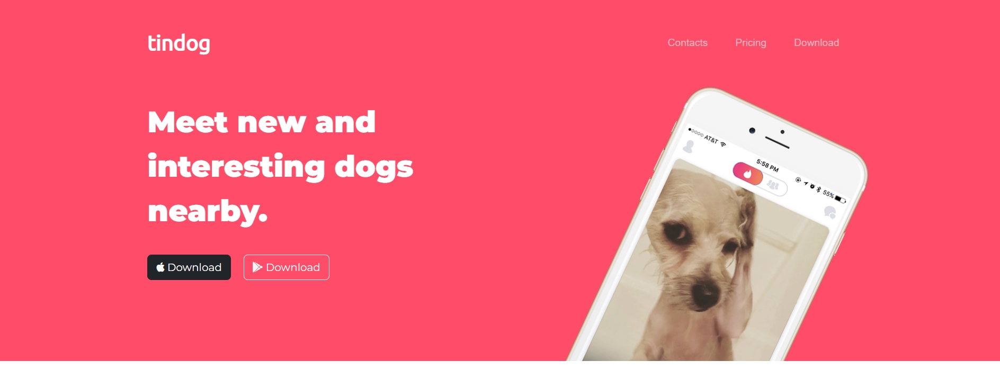
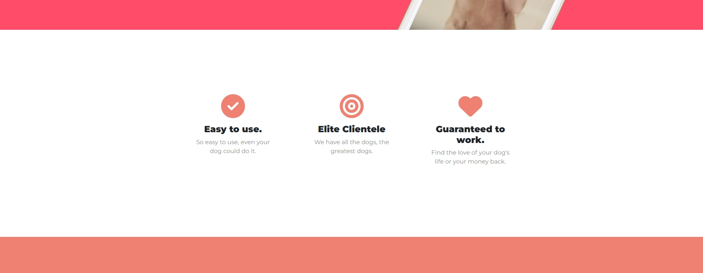
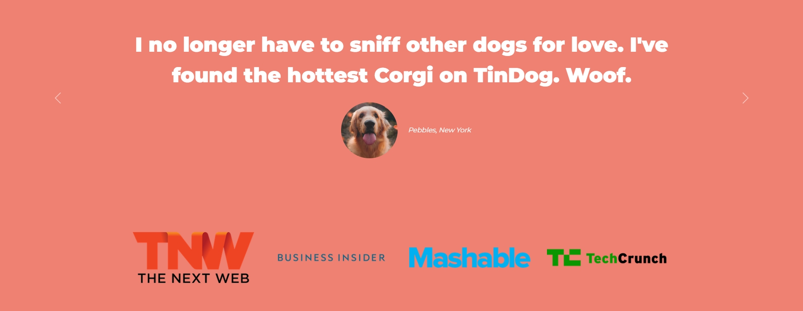
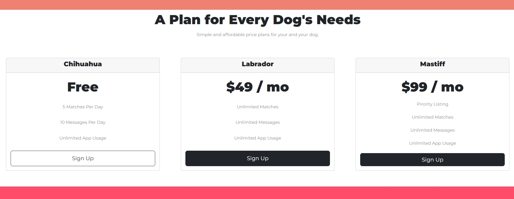
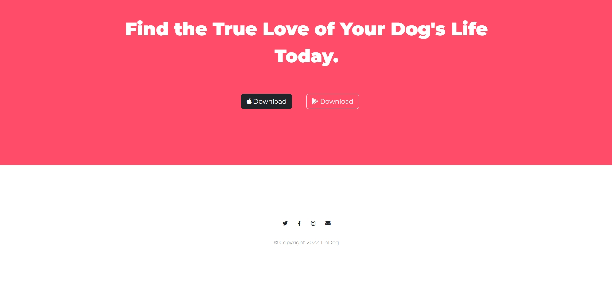

# TinDog Project

## About the Project: 📚
This project is created to practise Bootstrap skills in the scope of "The Complete 2022 Web Development Bootcamp".

## Screenshots: 📷

- Header Section

In this part responsive navbar is added.

- Features Section

 - Testimonials Section

 In this part carousel is added.

- Pricing Section

- Call to Action and Footer Section

## Technologies Used: ☕️ 🐍 ⚛️

### Built with

- HTML
- CSS
- JavaScript

## Author
- [@tugbaesat](https://github.com/tugbaesat)
