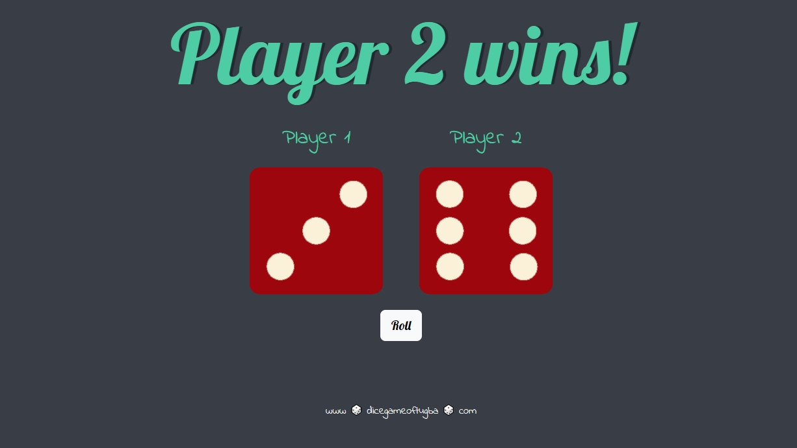

# Dicee Challenge

## About the Project: 📚
This project is created to practise JavaScript skills in the scope of "The Complete 2022 Web Development Bootcamp". In this project the aim is to create a website that you can roll two dices and the numbers are randomly appointed to dices. The player who has greater value wins. The equality case is also considered.

## Screenshots: 📷

- Roll the Dice Page

- Player 1 Wins Case

- Player 2 Wins Case

- Draw Case

## Technologies Used: ☕️ 🐍 ⚛️

### Built with

- HTML
- CSS
- JavaScript

## Author
- [@tugbaesat](https://github.com/tugbaesat)
